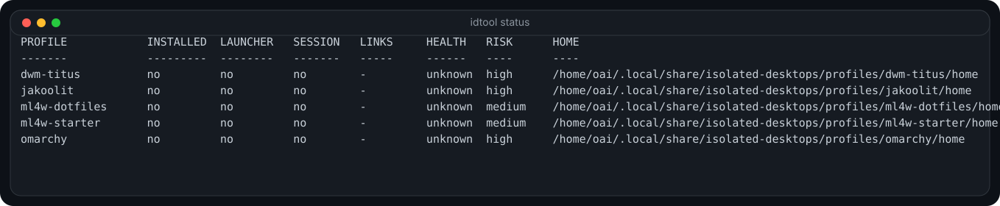
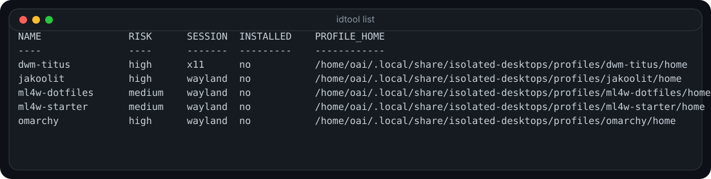

# isolated-desktops

Version: **1.6.1**

`isolated-desktops` is a **session-profile manager** for testing multiple Linux desktop setups on a single machine while keeping the **same Linux user** and **separate session homes**.

The repository name stays `isolated-desktops` because it is short and memorable, but the project is documented precisely:

- it **does isolate profile-level user files**
- it **does not isolate the whole operating system**

This project should therefore be understood as **session-profile isolation**, not VM-style or container-style system isolation.

## Quick start

```bash
git clone https://github.com/Vguver/isolated-desktops.git
cd isolated-desktops
chmod +x install.sh
./install.sh --bootstrap

# See the supported profile names from your local checkout
scripts/idtool.sh list --names-only

# Inspect a profile before installing it
scripts/idtool.sh analyze <profile-name>

# Install and verify the profile
scripts/idtool.sh install <profile-name>
scripts/idtool.sh verify <profile-name>

# Create a launcher and a login session
scripts/idtool.sh launcher create <profile-name>
scripts/idtool.sh session create <profile-name> --scope user --type wayland
```

Example:

```bash
scripts/idtool.sh analyze omarchy
scripts/idtool.sh install omarchy
scripts/idtool.sh verify omarchy
```

## Screenshots

### Status dashboard



### Available profile list



## What this project solves

Many third-party desktop projects assume a fresh installation. When you try several of them on one real machine, their user configuration files tend to mix together.

`isolated-desktops` keeps **one Linux account** but lets you start **different sessions** that each point to a different profile home. That makes it much easier to:

- test multiple desktop setups on one system
- compare how different projects structure their configuration
- keep the parts you like and discard the rest
- edit profile files from VS Code or VSCodium through generated workspaces
- export, import, verify, update, and snapshot profiles with a cleaner workflow

## What is isolated

Separated per profile:

- `HOME`
- `.config`
- `.local/share`
- `.cache`
- `.local/state`
- profile-specific logs, reports, snapshots, backups, workspaces, managed dotfiles, and runtime helpers

Still shared system-wide:

- installed packages
- services
- `/etc`
- `/usr`
- display-manager behavior
- anything an upstream installer decides to change outside the profile home

## Main concepts

The project is organized around these layers:

1. **manifests** describe supported upstream desktop projects
2. **adapters** handle project-specific installation behavior
3. **profiles** store the real per-session state on disk
4. **managed dotfiles** provide safer symlink-based editing and recovery
5. **editor workspaces** make profile editing practical from VS Code or VSCodium
6. **verification, rollback, trash, export, and presets** make the workflow safer and easier to maintain

This replaces the older generic approach of “find any `install.sh` and run it”.

## Current project layout

```text
isolated-desktops/
├── assets/
│   └── screenshots/
├── docs/
├── examples/
├── manifests/
├── presets/
├── scripts/
│   ├── adapters/
│   ├── commands/
│   ├── completions/
│   └── lib/
├── tests/
├── CHANGELOG.md
├── CODE_OF_CONDUCT.md
├── CONTRIBUTING.md
├── INSTALLATION.md
├── LICENSE
├── SECURITY.md
├── VERSION
└── install.sh
```

Installed profile state lives outside the repository under:

```text
~/.local/share/isolated-desktops/profiles/<profile-name>/
```

Each profile contains:

```text
home/
repo/
logs/
reports/
snapshots/
runtime/
dotfiles/
workspace/
backups/
meta.json
```

## Main commands

```bash
./install.sh --bootstrap
scripts/idtool.sh status
scripts/idtool.sh list
scripts/idtool.sh analyze <profile-name>
scripts/idtool.sh install <profile-name>
scripts/idtool.sh update <profile-name>
scripts/idtool.sh verify <profile-name>
scripts/idtool.sh launcher create <profile-name>
scripts/idtool.sh session create <profile-name> --scope system
scripts/idtool.sh links prepare <profile-name>
scripts/idtool.sh workspace open <profile-name>
scripts/idtool.sh sync <profile-name>
scripts/idtool.sh export <profile-name>
scripts/idtool.sh start <profile-name>
scripts/idtool.sh completion install
scripts/idtool.sh self-update
```

Use `scripts/idtool.sh list --names-only` to discover available profile names.

## Typical workflow

```bash
# 1. See which profiles are available
scripts/idtool.sh list --names-only

# 2. Review the install plan
scripts/idtool.sh analyze <profile-name>

# 3. Install the profile
scripts/idtool.sh install <profile-name>

# 4. Verify the resulting setup
scripts/idtool.sh verify <profile-name>

# 5. Create a launcher and an optional login session
scripts/idtool.sh launcher create <profile-name>
scripts/idtool.sh session create <profile-name> --scope user --type wayland

# 6. Start the profile or open its editor workspace
scripts/idtool.sh start <profile-name>
scripts/idtool.sh workspace open <profile-name>
```

## Managed dotfiles

By default, managed dotfiles live **inside the profile itself**:

```text
~/.local/share/isolated-desktops/profiles/<profile-name>/dotfiles/home/
```

Useful commands:

```bash
scripts/idtool.sh links prepare <profile-name>
scripts/idtool.sh links link <profile-name> .config
scripts/idtool.sh links adopt <profile-name> .config
scripts/idtool.sh links repair <profile-name>
scripts/idtool.sh links status <profile-name>
```

You can still override the dotfiles base with `ID_DOTFILES_ROOT` if you intentionally want an external tree.

## Editor workflow

The project generates real VS Code / VSCodium workspace files.

```bash
scripts/idtool.sh workspace create <profile-name>
scripts/idtool.sh workspace open <profile-name>
```

The generated workspace includes:

- profile home
- cloned repository
- managed dotfiles
- logs
- reports
- snapshots
- backups

## Health checks and updates

Before trusting a profile, use:

```bash
scripts/idtool.sh analyze <profile-name>
scripts/idtool.sh verify <profile-name>
```

To re-run installation logic against an already installed profile:

```bash
scripts/idtool.sh update <profile-name>
```

## Export, import, trash, and presets

```bash
scripts/idtool.sh export <profile-name>
scripts/idtool.sh import ~/.local/share/isolated-desktops/exports/<profile-name>-YYYYMMDD-HHMMSS.tar.gz
scripts/idtool.sh remove <profile-name>
scripts/idtool.sh trash list
scripts/idtool.sh trash restore <trash-id>
scripts/idtool.sh preset list
scripts/idtool.sh preset install hyprland-suite
```

## Safety features

Highlights from the hardened 1.5.x and 1.6.x line:

- stale-lock recovery for fallback lock mode
- transaction-style rollback snapshots stored outside the live profile tree
- stronger managed-dotfiles adoption with staged copies and restore-on-failure behavior
- broader default managed paths (`.config`, `.local/bin`, `.local/share`)
- healthier verification checks for launcher syntax, session file format, repository integrity, and start-command availability
- atomic first clone into a temporary checkout before moving into place
- export archive verification and improved import checks
- safer cleanup of custom manifests and external dotfiles when removing profiles
- Bash completion support and git-based project self-update
- lifecycle and resilience tests for clone failures, disk-space guards, interrupted installs, and lock contention

## Strong warning

This project is much safer and cleaner than the original generic-script approach, but it still **cannot guarantee** that every third-party installer will stay inside the profile.

If an upstream installer:

- installs packages
- edits `/etc`
- enables services
- writes into `/usr/share`
- changes display manager settings

those are still **host-wide changes**.

Always run:

```bash
scripts/idtool.sh analyze <profile-name>
scripts/idtool.sh verify <profile-name>
```

before trusting a profile on your main machine.

## Requirements

Required:

- Bash 4+
- Git
- curl

Recommended:

- an Arch-based host if you want to test Arch-specific desktop installers
- VS Code or VSCodium for workspace editing
- a display manager such as SDDM, GDM, or LightDM if you want login-screen sessions

## Included documentation

- `INSTALLATION.md`
- `docs/ARCHITECTURE.md`
- `docs/ADAPTERS.md`
- `docs/MANIFESTS.md`
- `docs/STATE-LAYOUT.md`
- `docs/TROUBLESHOOTING.md`
- `docs/FAQ.md`
- `docs/MIGRATION_FROM_V2.md`
- `CONTRIBUTING.md`
- `SECURITY.md`
- `CODE_OF_CONDUCT.md`

## Publishing and legal notes

This repository uses the MIT License for the project code itself. Third-party desktop projects referenced by manifests keep their **own licenses, trademarks, assets, and install logic**. If you later add screenshots, wallpapers, themes, fonts, or copied upstream files, review the license of each upstream project before redistributing them.

## Community files

This repository includes:

- `LICENSE`
- `CONTRIBUTING.md`
- `SECURITY.md`
- `CODE_OF_CONDUCT.md`

These files help GitHub show a healthier public project profile and make expectations clearer for contributors and users.

## License

Released under the MIT License. See `LICENSE`.
